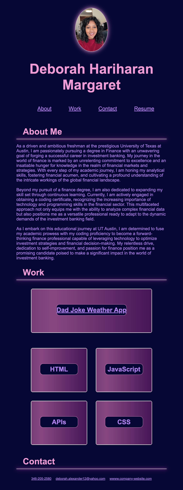

# DEBORAH's PORTFOLIO

## Link to Deployed Application

## Description

Explore my portfolio—a digital reflection of my academic path, skills, and projects. Embarking on this project was fueled by a personal aspiration to establish an online presence that genuinely mirrors my journey, skills, and creative endeavors. This endeavor addresses the challenge of presenting a comprehensive overview of my skills and aspirations, offering visitors insights into my background and the projects I've poured my energy into. Throughout this process, I've gained a profound understanding of effective digital storytelling, where each section functions as a narrative piece contributing to a cohesive representation of who I am. It's not just about information; it's about creating a meaningful and holistic digital identity.

## Usage

Explore different sections such as "About Me," "Work," and "Contact" to learn more about my background and projects.

Desktop view: 

.png>)

Tablet View: 

Mobile View: 

.png>)

## License

MIT Liscense

## Features

1. Flexbox and Grid Layouts: Employing Flexbox for streamlined alignment and spacing of navigation elements and cards, and Grid Layout for responsive organization of the "Work" section, enhancing overall layout control.

2. Box Shadow and Border Radius: Incorporating box shadow effects, like the subtle glow around the image, to create a visual lift. 

3. Keyframe Animations: Introducing keyframe animations for a dynamic gradient effect on certain elements, such as the background of the cards in the "Work" section, enhancing the visual appeal and interactivity.

4. Media Queries: Implementing media queries to ensure a responsive design that adapts seamlessly to different screen sizes, optimizing the user experience across various devices.

5. Hover Effects: Adding hover effects to cards and sections, using box-shadow adjustments to create an interactive and visually engaging experience for users as they navigate through the content.

6. Linear Gradients: Employing linear gradients in the background of cards to introduce subtle color transitions, enhancing the overall aesthetics and contributing to a modern design.

